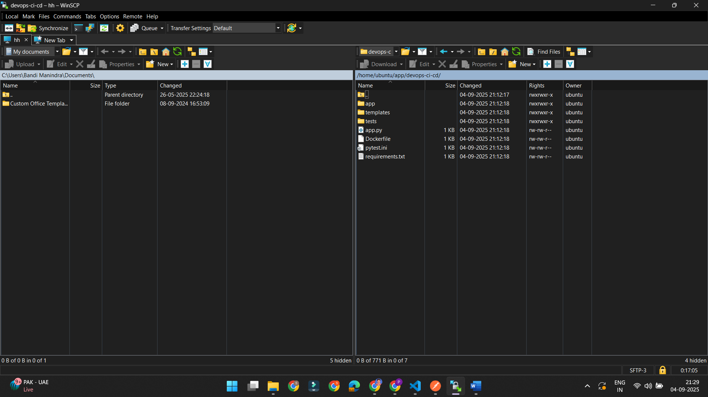
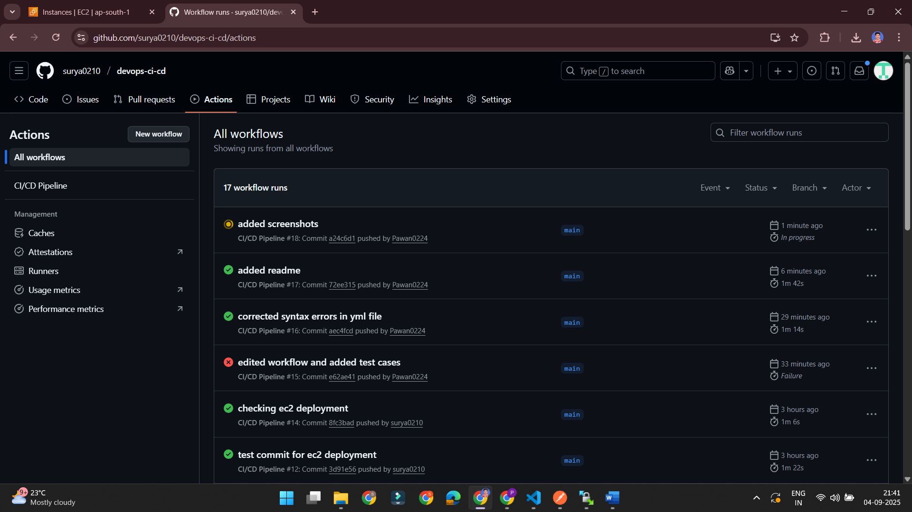
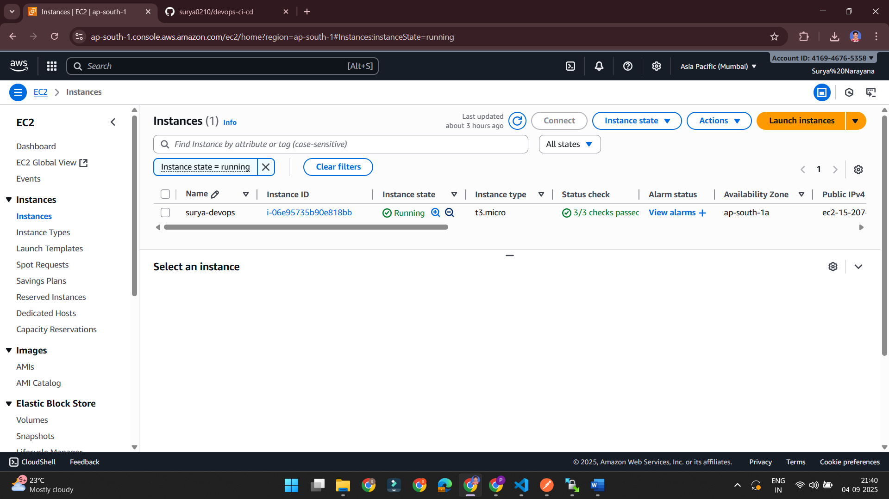
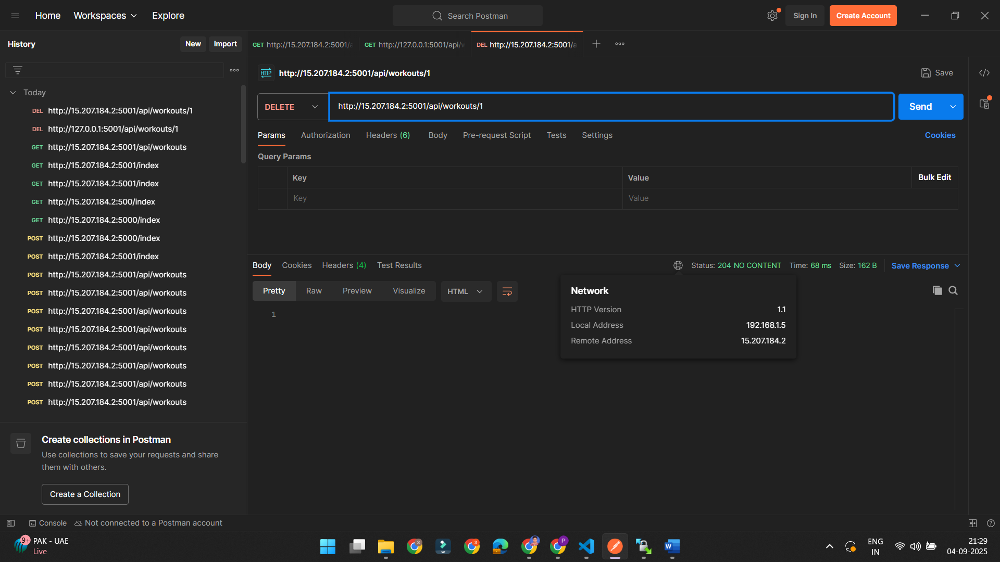
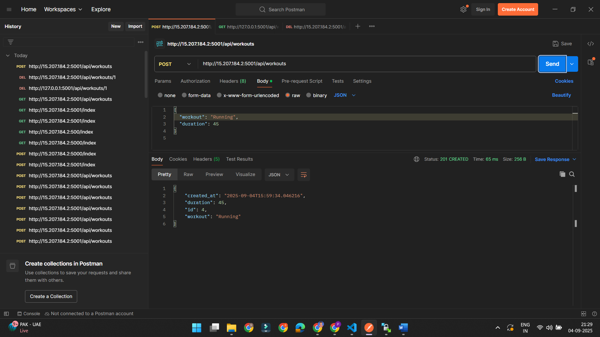

# ACEest Fitness & Gym — Flask App

A minimal, production‑ready Flask application for **ACEest Fitness & Gym**.  
It demonstrates a clean Flask project layout with SQLAlchemy models, HTML templates, static assets, Pytest tests, Docker support, and CI via GitHub Actions.

---

## ✨ Features

- Flask application with application factory pattern (`app/__init__.py`)
- SQLAlchemy models (`app/models.py`) and config separation (`app/config.py`)
- HTML templates with a base layout (`app/templates/`) and static CSS (`app/static/css/`)
- API blueprint & routes (`app/routes.py`) including a health check
- Pytest test suite (`/tests`) with `pytest.ini`
- Dockerfile for containerized runs
- GitHub Actions workflow for CI (`.github/workflows/ci.yml`)
- Instance folder for environment‑specific files (`/instance` — gitignored)

---

## 🧰 Tech Stack

- Python 3.10+
- Flask
- SQLAlchemy
- Pytest
- Docker
- GitHub Actions

---

## 🗂️ Project Structure

```
.
├── .github/workflows/ci.yml       # CI pipeline (Pytest, etc.)
├── .pytest_cache/                 # Pytest cache (ignored)
├── app/
│   ├── __pycache__/               # Bytecode cache
│   ├── static/css/styles.css      # App styles
│   ├── templates/
│   │   ├── base.html              # Base layout
│   │   └── index.html             # Home page
│   ├── __init__.py                # App factory + extensions
│   ├── config.py                  # Config classes (Dev/Prod/Test)
│   ├── models.py                  # SQLAlchemy models
│   └── routes.py                  # Blueprints & endpoints
├── instance/                      # Local env files/db (not checked in)
├── tests/                         # Pytest tests
├── venv/                          # Local virtual env (gitignored)
├── .dockerignore
├── .gitignore
├── app.py                         # Entrypoint (run server)
├── Dockerfile
├── pytest.ini
├── requirements.txt
└── README.md
```

> **Note**: The `instance/` folder is for things like `instance/config.py`, `app.sqlite`, or other local resources and is intentionally gitignored.

---

## 🚀 Getting Started (Local)

### 1) Clone & create a virtual environment

**Windows (PowerShell):**

```powershell
python -m venv venv
.env\Scripts\Activate.ps1
```

**macOS / Linux:**

```bash
python3 -m venv venv
source venv/bin/activate
```

### 2) Install dependencies

```bash
pip install -r requirements.txt
```

### 3) Set environment variables

Use Flask’s env vars. (Windows PowerShell shown first.)

**Windows:**

```powershell
$env:FLASK_APP="app"
$env:FLASK_ENV="development"
# Optional: choose a port (defaults may be 5000/5001 depending on app.py)
$env:FLASK_RUN_PORT="5001"
```

**macOS / Linux (bash/zsh):**

```bash
export FLASK_APP=app
export FLASK_ENV=development
export FLASK_RUN_PORT=5001
```

If `app.py` already runs the app directly (e.g., `if __name__ == "__main__":`), you can simply run:

```bash
python app.py
```

Otherwise you can use:

```bash
flask run
```

### 4) Initialize the database (SQLite example)

If your app uses SQLAlchemy and does not auto‑create tables, run:

```bash
python - <<'PY'
from app import create_app
from app.models import db
app = create_app()
with app.app_context():
    db.create_all()
print("Database initialized.")
PY
```

### 5) Open the app

Visit http://localhost:5001/ (or the port printed in your terminal).

---

## 🧪 Running Tests

Run the Pytest suite:

```bash
pytest -q
```

With coverage:

```bash
pytest -q --maxfail=1 --disable-warnings --cov=app --cov-report=term-missing
```

---

## 🧭 API Quick Reference

These are the common endpoints expected from the provided layout (your `routes.py` may include more):

- `GET /health` → `{ "status": "ok" }`  
  Health check to verify the app is running.

- `GET /workouts` → JSON list of workouts
- `POST /workouts` → Create a workout  
  **Body (JSON):**
  ```json
  {
    "workout": "Running",
    "duration": 30
  }
  ```
  **Responses:**
  - `201 Created` with the created workout
  - `400 Bad Request` with validation errors

> Check `app/routes.py` and `app/models.py` for the full, authoritative API behavior implemented in your copy.

---

## 🐳 Docker

Build the image:

```bash
docker build -t aceest-fitness-app:latest .
```

Run the container (mapping container port `5001` → host port `5001`):

```bash
docker run --rm -p 5001:5001 aceest-fitness-app:latest
```

Then open: http://localhost:5001

If you want to hot‑reload while developing, prefer running locally with `flask run`. For production, use a proper WSGI server (e.g., gunicorn/uwsgi) behind a reverse proxy.

---

## 🔁 Continuous Integration (GitHub Actions)

The workflow in `.github/workflows/ci.yml` runs the test suite on each push/PR.  
It’s a good place to add linters (flake8/ruff), type‑checks (mypy), and coverage gating.

Example badges you can add to this README once CI is live:

```

```

---

## 🔧 Configuration

- Update `app/config.py` to switch between Development/Production/Test settings.
- Use environment variables for secrets like database URLs and secret keys.
- Place local overrides in `instance/config.py` (and keep secrets out of Git).

---

## 🧩 Troubleshooting

- **“Working outside of application context”** → Ensure you are inside an app context when touching `db` or request‑bound objects. In tests, use `app.test_client()` and `app.app_context()` fixtures.
- **Port already in use** → Change `FLASK_RUN_PORT` or the `app.run(port=...)` in `app.py`.
- **CSS not loading** → Confirm `static/` structure and that templates use `{{ url_for('static', filename='css/styles.css') }}`.

---

## 🙌 Credits

Crafted for ACEest Fitness & Gym as a base to iterate on features like workout logging, member management, dashboards, and more.

Attaching screenshots for reference

EC2 instance



github actions


Aws ec2 instance creation


End points postman hit.






Please let me know when to turn on the server for your verifcation.Turning it off now due to low credits.
